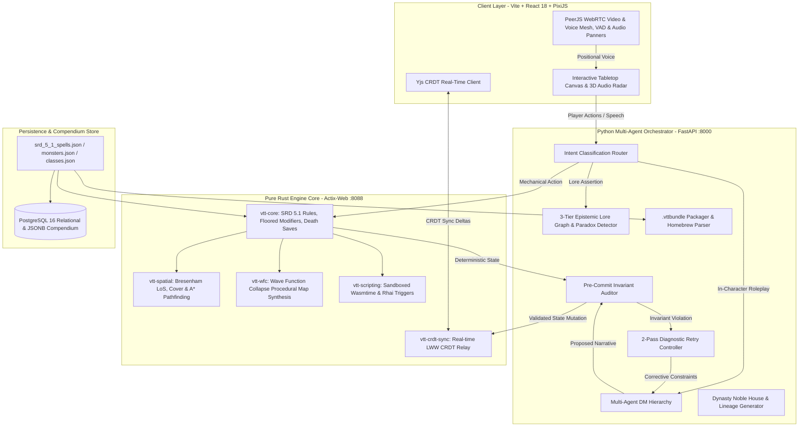

<div align="center">

# 🎲 Autonomous AI-Native Virtual Tabletop (VTT) & Game Master Engine

**An enterprise-grade, zero-trust Virtual Tabletop platform that decouples probabilistic LLM narrative generation from authoritative deterministic game state rules.**

[](https://github.com/Heretek-AI/TTRPG/actions/workflows/ci.yml)
[](https://www.rust-lang.org)
[](https://www.python.org)
[](https://reactjs.org)
[](LICENSE)
[](#benchmarks--quality-metrics)

</div>

---

## 🏛️ System Architecture

The platform is designed around a **Zero-Trust Multi-Agent & Authoritative State Engine** architecture:



---

## ✨ Key Features & Capabilities

### 1. ⚔️ Pure Rust Authoritative Rule Engine (`crates/vtt-core`)
- **D&D 5e SRD 5.1 Compliance**: Hardcoded, zero-allocation calculations for floored ability modifiers `(score - 10).div_euclid(2)`, proficiency bonus scaling `2 + ((lvl - 1) / 4)`, and 7 distinct Armor Class derivations (Unarmored, Monk, Barbarian, Light, Medium max +2, Heavy, Shield).
- **Deterministic Condition Matrix**: 15 SRD conditions (`Paralyzed`, `Unconscious`, `Restrained`, `Blinded`, `Poisoned`, `Frightened`, `Prone`, `Invisible`, `Incapacitated`, `Exhaustion 1..=6`) with automated saving throw auto-fails, attacker advantage/disadvantage bitmasks, and melee auto-critical hits within 5ft.
- **Combat & Action Dispatch**: 4-tier task resolution (Rule of Cool/PbtA hybrid), natural 20 critical double damage dice, natural 1 auto-misses, concentration damage checks ($DC = \max(10, \lfloor \text{damage}/2 \rfloor)$), and Death Saving Throw state machine with massive damage instant death.

### 2. 🗺️ Procedural WFC Map Synthesis & Spatial Geometry (`crates/vtt-wfc` & `crates/vtt-spatial`)
- **Wave Function Collapse (WFC)**: Procedurally synthesizes coherent dungeon layouts with socket matching, Shannon entropy minimization, and automated backtracking.
- **Raycasted Line-of-Sight & Cover**: Bresenham and SIMD raycasting computing Half (+2 AC), Three-Quarters (+5 AC), and Total Cover in real-time.
- **A* Pathfinding & Zone Graphs**: Dynamic grid navigation respecting movement cost modifiers, obstacle collision, and door states.

### 3. 🎙️ Positional 3D Web Audio Engine & WebRTC Video/Voice Mesh (`client/src/render/`)
- **Web Audio API Acoustics**: Real-time stereo panning ($p \in [-1.0, 1.0]$) and inverse-distance gain attenuation ($g = \frac{1}{1 + 0.15 \cdot d}$) calculated relative to the active listener token position, routed through an HRTF `PannerNode` chain.
- **Interactive 2D Acoustic Radar (`AudioMixerModal.tsx`)**: Concentric distance rings ($15\text{ft}$, $30\text{ft}$, $60\text{ft}$), sweeping radar beam, token blips with pulse rings, per-peer channel faders, and instant sound-effect spatial testers.
- **P2P WebRTC Mesh (PeerJS)**: Lobby-scoped video tiles (`VideoMeshTiles.tsx`) plus spatialized player voice streams routed through dedicated audio panner nodes, with Silero voice-activity detection in `voice_capture.ts`.

### 4. 📦 Campaign Archive Bundles (`.vttbundle`) & Homebrew Markdown Parser
- **Portable ZIP Archives**: `.vttbundle` package format encapsulating `manifest.json`, `map_layout.json`, `tokens.json`, `dynasties.json`, `lore_graph.json`, and `loot_tables.json`.
- **Homebrewery & GM Binder Importer**: Live Markdown parser converting custom monster stat blocks into tabletop tokens with 1-click deployment.
- **Bundle Studio View (`BundleManagerView.tsx`)**: Campaign export triggers, drag-and-drop bundle imports, and live Markdown editor with instant stat block preview.

### 5. 👑 Dynasty Lineage & Noble House Factions (`python/vtt_orchestrator/simulation/`)
- **Multi-Generation Family Trees**: Procedural generation of 3-generation noble bloodlines with genetic trait inheritance (physical traits, personality quirks, arcane bloodlines).
- **Inter-House Feud Matrix**: Dynamic diplomatic relationship graphs (Allied, Cold War, Blood Feud, Neutral, Vassal).
- **1-Click Tabletop Lore Injection**: Binds noble house lore, heraldry, and NPC factions directly into the active campaign lore graph.

### 6. 🛡️ Multi-Agent DM Invariant Auditor & Epistemic Lore Graph
- **Pre-Commit Invariant Interceptor (`auditor/inspector.py`)**: Audits every LLM draft narrative against live engine state before it is streamed, guaranteeing spatial invariance, entity conservation, mechanical feasibility, and zero math-narrative contradictions; drafts that fail are never emitted.
- **2-Pass Diagnostic Retry Loop**: Automatically re-prompts the DM with structured negative constraints when an invariant failure is detected.
- **3-Tier Epistemic Graph**: Manages Subjective Rumors, Proposed Facts, and Validated Canon with automated paradox detection and lore-triple extraction from drafts. Runs in-memory by default, with an optional Neo4j-backed projection selected at startup via `NEO4J_ENABLED=1` (`lore/neo4j_graph.py`).

---

## 🚀 Quickstart Guide

### Prerequisites
- **Rust Toolchain**: stable (`rustup default stable`)
- **Python**: 3.11 or 3.12 (`pip install -e python/`)
- **Node.js**: 20+ & npm (`cd client && npm install`)
- **Docker & Docker Compose** (optional for production container orchestration)

---

### Local Development Setup

#### 1. Clone the Repository
```bash
git clone https://github.com/Heretek-AI/TTRPG.git
cd TTRPG
```

#### 2. Run Authoritative Rust Engine
```bash
PORT=8088 cargo run -p vtt-server
```
*Health Check*: `http://localhost:8088/health`

#### 3. Run Python Multi-Agent Orchestrator
```bash
PYTHONPATH=python python3 -m vtt_orchestrator.server
```
*API Documentation*: `http://localhost:8000/docs`

#### 4. Run Vite Frontend Client
```bash
cd client
npm install
npm run dev
```
*Web UI*: `http://localhost:3000`

---

## 🧪 Benchmarks & Quality Metrics

The platform includes a synthetic multi-agent playtest benchmark runner simulating hundreds of concurrent combat turns across diverse player archetypes (Tactician, Roleplayer, Chaos Goblin).

```bash
./scripts/run_all_benchmarks.sh
```

Gates enforced by `scripts/run_all_benchmarks.sh` and CI:

| Metric / Gate | Target |
| :--- | :---: |
| **Mechanical Compliance Rate (MCR)** | $\ge 98.5\%$ |
| **Hallucination & Continuity Index (HCI)** | $\ge 0.95$ |
| **Auditor False-Positive Rate (AFPR)** | $\le 1.5\%$ |
| **Auditor Recall** (lethal-narrative probes) | $\ge 95\%$ |
| **Rust Test Suite** (`cargo test --workspace`) | all pass (461 tests) |
| **Python Test Suite** (`PYTHONPATH=python pytest python/tests`) | all pass (1035 collected; 1006 pass, 29 skip — engine-live and live-LLM suites gate/skip when unset) |
| **Client Unit Tests** (`npx vitest run`) | all pass (407 tests across 33 files; plus the relay suite via `vitest.relay.config.mjs`, 66 tests) |
| **Client Production Build** (`npm run build`) | zero TypeScript errors |

Latest full local run (2026-08-24, `./scripts/run_all_benchmarks.sh`, 200 turns against a live engine): MCR 100%, HCI 1.00, AFPR 0.0%, auditor recall 100% (15/15 probes), trust-boundary probes 7/7 rejected; measured latency SLA: rules 0.39ms p50, spatial ~0.35ms, intent keyword 1.10ms. These are synthetic self-play results against a scripted playtester; they are not a claim about arbitrary homebrew content.

---

## 📍 Current Status

**Real and exercised today:**
- **Engine-authoritative rules**: server-side attack/cast/move/death-save resolution in `vtt-core` with ids-only payloads (`deny_unknown_fields`), action budgets, condition lifecycle timers, spell slot deduction, concentration checks, reaction stack, and safety rewind with full state replay.
- **Full SRD combat maneuver suite**: grapple/shove contested checks with reach and economy gates, two-weapon fighting, the Help action, opportunity attacks (with Disengage suppression), and Ready actions with structured triggers (`ReadiedTrigger` variants; trigger resolution stays GM-adjudicated) — wired end-to-end through engine, gateway, and client (with rewind on contested-action failure).
- **Player-facing resource systems**: inspiration (award/spend lifecycle wired on the wire), hit-dice short rests, and the 6-level exhaustion ladder in `vtt-core`.
- **Dice notation**: `kh`/`kl` keep-drop, `ro` reroll-once, and exploding dice parsed in `vtt-core/src/dice.rs` (unit-tested in `dice_notation_tests.rs`).
- **RBAC at every tier**: role claims in gateway tokens (legacy no-role tokens default to Player), entity ownership enforcement, spectator restrictions, fog-layer ownership, owner-or-GM guards on privileged session routes, GM-only monster spawns, and **wire-level relay RBAC** — hidden tokens, spectator ingress, private fog, and role-projected initial-state snapshots enforced inside the Rust WS relay.
- **WFC dungeons**: real solver with reseed retries, wildcard sockets, flood-fill single-region guarantee, deterministic dressing — and a client studio that generates real maps through an engine proxy (no fabricated previews).
- **AI orchestrator with live LLM support**: tool-calling agent (`agents/tool_agent.py`) plus streaming narrative against any OpenAI-compatible endpoint configured via `.env` (`LLM_API`/`LLM_KEY`/`LLM_MODEL`); audited-before-yield streaming with honest degradation when no key is present, plus an opt-in live-LLM test suite.
- **Campaign simulation & Concordia NPC endpoint**: empirical playtester sim with a social-dialogue phase (norms enforcement, stance shifts), AI companion PCs, and a parametrized quest engine (theme tables, level scaling) exposed via `/api/v1/quest/*`.
- **Dynasty engine**: multi-generation lineages, alliances, and prestige, served on real endpoints and rendered in a client dynasty view.
- **Handouts & campaign autosave**: role-enforced handout persistence (create/read/update with owner + role checks) and GM campaign autosave from live engine state, both fail-closed on auth.
- **CRDT sync**: Yjs is the default transport via an HMAC-authenticated relay upgrade, with automatic fallback to the engine LWW relay; atmosphere state syncs over the same relay with client-side LWW convergence.
- **WebRTC video & voice** via PeerJS (lobby-scoped mesh with real `<video>` tiles and honest connection-failure states), Silero VAD capture, HRTF positional audio bound to board tokens.
- **Client quality gates**: vitest unit suite (407 tests across 33 files) covering SRD character math tables, encounter XP budgets, viewport sync, atmospheres, transport/auth gates, wizard state, concentration/opportunity/help-ready state modules, and streamer view DOM behavior; plus real engine-state-driven boss health bar / initiative HUD, spellbook casts via the engine slot pipeline, encounter builder on live compendium data, Roll20 import, and compendium search.
- **Vision modes, lighting zones & visibility polygons**: per-token vision modes and lighting-zone state in the engine, polygon visibility computation in `vtt-spatial/src/visibility.rs`, rendered client-side via raycast lighting.
- **Loot containers & autosave policies**: WFC-placed loot containers surfaced through the gateway, and configurable GM campaign autosave policies (verified by `test_autosave_policy.py`).
- **Campaign wizard & streamer view**: multi-step campaign wizard modal with persisted client-side wizard state, plus a streamer HUD view with opt-in browser-Whisper speech-to-text (`BrowserWhisperTranscriber`, off unless explicitly enabled).
- **Compendium RAG**: optional fastembed-backed semantic retrieval over the compendium (`lore/compendium_rag.py`), degraded honestly when embeddings are unavailable.
- **Spatial audio, fog-of-war rendering, initiative tracking**, lobbies (create/join-by-code/host-only launch), character persistence with RBAC-owned deploy, and engine-side request rate limiting (60s sliding window buckets: script 10/min, action 120/min, read 600/min; `/health`, `/metrics` and `/ws` unmetered).

**Known limitations (documented, not hidden):**
- Quest routes (`POST /api/v1/quest/generate`, `GET /api/v1/quest/active`, `POST /api/v1/quest/concordia-negotiate`) have **no server-side auth dependency**, unlike handouts/autosave; generated quest graphs also live only in gateway process memory and do not survive a restart.
- Relay fan-out is per-frame role-filtered (`broadcast_if`), not per-seat projected — hidden-token movement deltas go to GM peers as a class, not recomputed per recipient.
- The relay applies **no role/ownership validation to atmosphere writes**; atmosphere converges by client-side LWW only.
- The video mesh has **no TURN/STUN configured** (default PeerJS signaling/ICE); symmetric-NAT pairs may fail to connect — failures surface honestly but are not fixed.
- Compendium spell-damage coverage is conservative: 82 of 352 spells enriched (up from a 73-spell baseline); warned or no-damage spells stay field-free instead of guessing.
- Rate-limit buckets are process-local (no distributed limiter).
- The rule-version preference chosen in the campaign wizard is **not persisted server-side**; it is client-held metadata.
- If every WFC synthesis attempt contradicts, generation falls back to an open walled box.

---

## 📂 Repository Layout

```
.
├── .agents/skills/                     # Reusable agent skills & architectural guides
├── .github/workflows/ci.yml            # CI/CD multi-agent test matrix
├── compendium/                         # Normalized SRD JSON Compendiums (5.1 + 5.2)
│   ├── srd_5_1_spells.json             # 319 SRD 5.1 Spells
│   ├── srd_5_1_monsters.json           # 318 SRD 5.1 Monsters
│   ├── srd_5_1_classes.json            # 6 SRD 5.1 Classes
│   ├── srd_5_1_equipment.json          # 15 Weapons, Armors & Magic Items
│   ├── srd_5_1_rules.json              # 15 Conditions, Cover & Resting
│   ├── srd_5_1_tiles.json              # 3 WFC Tile Definitions
│   ├── srd_5_2_*.json                  # SRD 5.2 spells, monsters, feats, origins, magic items, animals, glossary
│   └── sample_adventure.vttbundle      # Importable sample campaign bundle
├── crates/                             # Authoritative Rust Workspace
│   ├── vtt-core/                       # SRD 5.1 Rules, Actions, Modifiers & Death Saves
│   ├── vtt-spatial/                    # LoS Raycasting, Cover & A* Pathfinding
│   ├── vtt-wfc/                        # Procedural Wave Function Collapse Synthesis
│   ├── vtt-crdt-sync/                  # Yjs CRDT Multiplayer Relay
│   ├── vtt-scripting/                  # Wasmtime & Rhai Sandboxed Execution
│   └── vtt-server/                     # Actix-Web Server & WebSocket API Gateway
├── database/postgres/                  # PostgreSQL Relational DDL & tsvector Schemas
│   └── 01_compendium_schema.sql        # Tables for monsters, spells, classes, rules
├── python/                             # Python Orchestrator & Multi-Agent DM Tier
│   ├── vtt_orchestrator/
│   │   ├── agents/                     # Multi-Agent DM Hierarchy & LLM Tool-Calling Agent
│   │   ├── auditor/                    # Pre-Commit Auditor & 2-Pass Retry Controller
│   │   ├── compendium/                 # SRD Importer, Bundle Packager & Markdown Parser
│   │   ├── lore/                       # 3-Tier Epistemic Graph & Optional Neo4j Projection
│   │   ├── playtest/                   # Synthetic Playtest Benchmark & Trust Probes
│   │   ├── routing/                    # Intent Router, Engine Client & LLM Client
│   │   ├── simulation/                 # Dynasty Engine & Empirical Playtester
│   │   └── server.py                   # FastAPI REST & SSE Streaming Gateway
│   └── tests/                          # Pytest Unit & Integration Test Suites (~580 collected)
├── client/                             # Presentation Layer (Vite + React 18 + Tailwind)
│   ├── src/
│   │   ├── components/                 # UI Modals, Radars, Studios & Tabletop View
│   │   ├── render/                     # Positional 3D Audio, WebRTC Mesh & Raycast Lighting Managers
│   │   ├── api/                        # Engine/Gateway Clients & Deterministic State Modules
│   │   ├── sync/                       # Yjs CRDT Transport & Speech Ledger Clients
│   │   └── App.tsx                     # Main Application Shell
└── scripts/
    └── run_all_benchmarks.sh           # Unified Multi-Service Benchmark Suite
```

---

## 📡 API & Protocol Specifications

### Core HTTP Endpoints
- `GET /health`, `GET /metrics`, `GET /ws/sessions/{id}/sync` (Rust :8088): Engine health, Prometheus metrics, and the live CRDT sync WebSocket (unmetered ops paths).
- `POST /api/v1/intent/classify` (Python :8000): Classifies player voice/text into structured action payloads.
- `POST /api/v1/narrative/generate` (Python :8000): Streams DM narrative through the pre-commit auditor (SSE).
- `POST /api/v1/lobbies` / `POST /api/v1/lobbies/{id}/join` / `POST /api/v1/lobbies/{id}/launch` (Python :8000): Lobby lifecycle with host-only launch.
- `POST /api/v1/characters` ... `POST /api/v1/characters/{id}/deploy` (Python :8000): Persistent character CRUD and RBAC-owned deployment into a session.
- `POST /api/v1/engine/{spawn,cast-spell,move,turn-next,damage,reactions/arm}` (Python :8000): Orchestrator proxies to the authoritative engine; require a `?token=` gateway session token.
- `POST /api/v1/campaign/export-bundle` / `import-bundle` (Python :8000): Round-trip `.vttbundle` export and hydration.
- `POST /api/v1/homebrew/parse-markdown` (Python :8000): Parses Homebrewery markdown; fails loudly with warnings instead of fabricating stat blocks.
- `GET /api/v1/dynasty/factions` (Python :8000): Retrieves procedural noble houses and feud matrix.

*Verify against the live OpenAPI schema at `http://localhost:8000/docs`.*

---

## 📄 License

This project is licensed under the **MIT License**. See [LICENSE](LICENSE) for details.
