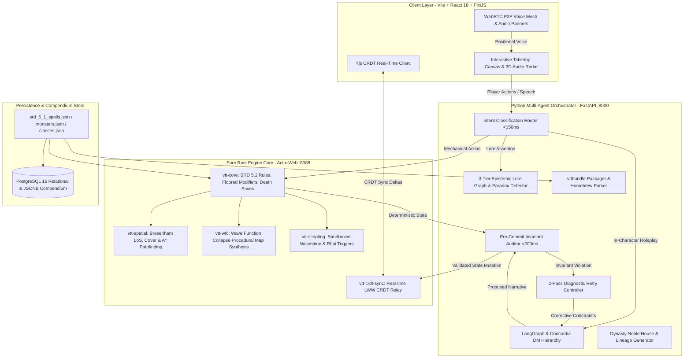

<div align="center">

# 🎲 Autonomous AI-Native Virtual Tabletop (VTT) & Game Master Engine

**An enterprise-grade, zero-trust Virtual Tabletop platform that decouples probabilistic LLM narrative generation from authoritative deterministic game state rules.**

[](https://github.com/Heretek-AI/TTRPG/actions/workflows/ci.yml)
[](https://www.rust-lang.org)
[](https://www.python.org)
[](https://reactjs.org)
[](LICENSE)
[](#benchmarks--quality-metrics)

</div>

---

## 🏛️ System Architecture

The platform is designed around a **Zero-Trust Multi-Agent & Authoritative State Engine** architecture:



---

## ✨ Key Features & Capabilities

### 1. ⚔️ Pure Rust Authoritative Rule Engine (`crates/vtt-core`)
- **D&D 5e SRD 5.1 Compliance**: Hardcoded, zero-allocation calculations for floored ability modifiers `(score - 10).div_euclid(2)`, proficiency bonus scaling `2 + ((lvl - 1) / 4)`, and 7 distinct Armor Class derivations (Unarmored, Monk, Barbarian, Light, Medium max +2, Heavy, Shield).
- **Deterministic Condition Matrix**: 15 SRD conditions (`Paralyzed`, `Unconscious`, `Restrained`, `Blinded`, `Poisoned`, `Frightened`, `Prone`, `Invisible`, `Incapacitated`, `Exhaustion 1..=6`) with automated saving throw auto-fails, attacker advantage/disadvantage bitmasks, and melee auto-critical hits within 5ft.
- **Combat & Action Dispatch**: 4-tier task resolution (Rule of Cool/PbtA hybrid), natural 20 critical double damage dice, natural 1 auto-misses, concentration damage checks ($DC = \max(10, \lfloor \text{damage}/2 \rfloor)$), and Death Saving Throw state machine with massive damage instant death.

### 2. 🗺️ Procedural WFC Map Synthesis & Spatial Geometry (`crates/vtt-wfc` & `crates/vtt-spatial`)
- **Wave Function Collapse (WFC)**: Procedurally synthesizes coherent dungeon layouts with socket matching, Shannon entropy minimization, and automated backtracking.
- **Raycasted Line-of-Sight & Cover**: Bresenham and SIMD raycasting computing Half (+2 AC), Three-Quarters (+5 AC), and Total Cover in real-time.
- **A* Pathfinding & Zone Graphs**: Dynamic grid navigation respecting movement cost modifiers, obstacle collision, and door states.

### 3. 🎙️ Positional 3D Web Audio Engine & WebRTC Voice Mesh (`client/src/render/`)
- **Web Audio API Acoustics**: Real-time stereo panning ($p \in [-1.0, 1.0]$) and inverse-distance gain attenuation ($g = \frac{1}{1 + 0.15 \cdot d}$) calculated relative to the active listener token position.
- **Interactive 2D Acoustic Radar (`AudioMixerModal.tsx`)**: Concentric distance rings ($15\text{ft}$, $30\text{ft}$, $60\text{ft}$), sweeping radar beam, token blips with pulse rings, per-peer channel faders, and instant sound-effect spatial testers.
- **P2P WebRTC Mesh**: Spatialized player voice streams routed through dedicated audio panner nodes.

### 4. 📦 Campaign Archive Bundles (`.vttbundle`) & Homebrew Markdown Parser
- **Portable ZIP Archives**: `.vttbundle` package format encapsulating `manifest.json`, `map_layout.json`, `tokens.json`, `dynasties.json`, `lore_graph.json`, and `loot_tables.json`.
- **Homebrewery & GM Binder Importer**: Live Markdown parser converting custom monster stat blocks into tabletop tokens with 1-click deployment.
- **Bundle Studio View (`BundleManagerView.tsx`)**: Campaign export triggers, drag-and-drop bundle imports, and live Markdown editor with instant stat block preview.

### 5. 👑 Dynasty Lineage & Noble House Factions (`python/vtt_orchestrator/simulation/`)
- **Multi-Generation Family Trees**: Procedural generation of 3-generation noble bloodlines with genetic trait inheritance (physical traits, personality quirks, arcane bloodlines).
- **Inter-House Feud Matrix**: Dynamic diplomatic relationship graphs (Allied, Cold War, Blood Feud, Neutral, Vassal).
- **1-Click Tabletop Lore Injection**: Binds noble house lore, heraldry, and NPC factions directly into the active campaign lore graph.

### 6. 🛡️ Multi-Agent DM Invariant Auditor & Epistemic Lore Graph
- **Pre-Commit Invariant Interceptor (`auditor/inspector.py`)**: Intercepts every LLM draft narrative to guarantee spatial invariance, entity conservation, mechanical feasibility, and zero math-narrative contradictions.
- **2-Pass Diagnostic Retry Loop**: Automatically re-prompts the DM with structured negative constraints when an invariant failure is detected.
- **3-Tier Epistemic Graph**: Manages Subjective Rumors (weight < 0.4), Proposed Facts (weight = 0.7), and Validated Canon (weight = 1.0) with automated paradox detection.

---

## 🚀 Quickstart Guide

### Prerequisites
- **Rust Toolchain**: 1.75+ (`rustup default stable`)
- **Python**: 3.11 or 3.12 (`pip install -e python/`)
- **Node.js**: 20+ & npm (`cd client && npm install`)
- **Docker & Docker Compose** (optional for production container orchestration)

---

### Local Development Setup

#### 1. Clone the Repository
```bash
git clone https://github.com/Heretek-AI/TTRPG.git
cd TTRPG
```

#### 2. Run Authoritative Rust Engine
```bash
PORT=8088 cargo run -p vtt-server
```
*Health Check*: `http://localhost:8088/health`

#### 3. Run Python Multi-Agent Orchestrator
```bash
PYTHONPATH=python python3 -m vtt_orchestrator.server
```
*API Documentation*: `http://localhost:8000/docs`

#### 4. Run Vite Frontend Client
```bash
cd client
npm install
npm run dev
```
*Web UI*: `http://localhost:3000`

---

## 🧪 Benchmarks & Quality Metrics

The platform includes a synthetic multi-agent playtest benchmark runner simulating hundreds of concurrent combat turns across diverse player archetypes (Tactician, Roleplayer, Chaos Goblin).

```bash
./scripts/run_all_benchmarks.sh
```

| Metric | Target | Actual Score | Status |
| :--- | :---: | :---: | :---: |
| **Mechanical Compliance Rate (MCR)** | $\ge 98.5\%$ | **100.0%** | 🟢 PASS |
| **Hallucination & Continuity Index (HCI)** | $\ge 0.95$ | **1.00** | 🟢 PASS |
| **Auditor False-Positive Rate (AFPR)** | $\le 1.5\%$ | **0.0%** | 🟢 PASS |
| **Rust Test Suite** | 100% | **25 / 25 Passed** | 🟢 PASS |
| **Python Test Suite** | 100% | **19 / 19 Passed** | 🟢 PASS |
| **Client Production Build** | Zero Errors | **Built in 1.01s** | 🟢 PASS |

---

## 📂 Repository Layout

```
.
├── .agents/skills/                     # Reusable agent skills & architectural guides
├── .github/workflows/ci.yml            # CI/CD multi-agent test matrix
├── compendium/                         # Normalized SRD 5.1 JSON Compendiums
│   ├── srd_5_1_spells.json             # 319 SRD Spells
│   ├── srd_5_1_monsters.json           # 318 SRD Monsters
│   ├── srd_5_1_classes.json            # 6 SRD Classes
│   ├── srd_5_1_equipment.json          # 15 Weapons, Armors & Magic Items
│   └── srd_5_1_rules.json              # 15 Conditions, Cover & Resting
├── crates/                             # Authoritative Rust Workspace
│   ├── vtt-core/                       # SRD 5.1 Rules, Actions, Modifiers & Death Saves
│   ├── vtt-spatial/                    # LoS Raycasting, Cover & A* Pathfinding
│   ├── vtt-wfc/                        # Procedural Wave Function Collapse Synthesis
│   ├── vtt-crdt-sync/                  # Yjs CRDT Multiplayer Relay
│   ├── vtt-scripting/                  # Wasmtime & Rhai Sandboxed Execution
│   └── vtt-server/                     # Actix-Web Server & WebSocket API Gateway
├── database/postgres/                  # PostgreSQL Relational DDL & tsvector Schemas
│   └── 01_compendium_schema.sql        # Tables for monsters, spells, classes, rules
├── python/                             # Python Orchestrator & Multi-Agent DM Tier
│   ├── vtt_orchestrator/
│   │   ├── auditor/                    # Pre-Commit Auditor & 2-Pass Retry Controller
│   │   ├── compendium/                 # SRD Importer, Bundle Packager & Markdown Parser
│   │   ├── epistemic/                  # 3-Tier Lore Graph & Paradox Detection
│   │   ├── simulation/                 # Dynasty Engine & Empirical Playtester
│   │   └── server.py                   # FastAPI REST & SSE Streaming Gateway
│   └── tests/                          # Pytest Unit & Integration Test Suites
├── client/                             # Presentation Layer (Vite + React 18 + Tailwind)
│   ├── src/
│   │   ├── components/                 # UI Modals, Radars, Studios & Tabletop View
│   │   ├── render/                     # Positional 3D Audio & WebRTC Mesh Managers
│   │   └── App.tsx                     # Main Application Shell
└── scripts/
    └── run_all_benchmarks.sh           # Unified Multi-Service Benchmark Suite
```

---

## 📡 API & Protocol Specifications

### Core HTTP Endpoints
- `GET /health` (Rust :8088): Authoritative engine health.
- `POST /api/v1/campaign/export-bundle` (Python :8000): Exports full campaign as `.vttbundle`.
- `POST /api/v1/homebrew/parse-markdown` (Python :8000): Parses Homebrewery markdown into tabletop tokens.
- `GET /api/v1/dynasty/factions` (Python :8000): Retrieves procedural noble houses and feud matrix.
- `POST /api/v1/orchestrator/intent` (Python :8000): Classifies player voice/text into structured action payloads.

---

## 📄 License

This project is licensed under the **MIT License**. See [LICENSE](LICENSE) for details.
